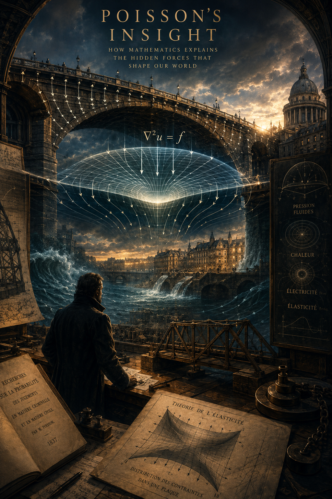

# 🧪 The Weekly Lab Report: Issue #6
**Your weekly 5-minute briefing on the frameworks shaping our world—all execution, zero fluff, zero ads.**

Welcome to Issue #6! What a weekend to be alive. Between the staggering momentum of Friday's SpaceX IPO rewriting the rules of the aerospace industry and that absolute thriller of a last-second Knicks playoff victory, the theme for this week is entirely about extreme probability. Speaking of extreme: congratulations to Elon Musk on officially becoming Earth's first trillionaire. Next time you hesitate over a €10 latte at your local fancy coffee shop, just remember that with a bit of hard work, an optimized high-volume routine, and a massive aerospace monopoly, your net worth could also be just a few hundred million years of salary away. 

Let's dive straight into the first principles behind the madness.

---

### 📅 Scientific Anniversaries
*   **June 16, 1963: Smashed Glass Ceilings in Orbit** 🚀
    Valentina Tereshkova became the first woman in space, orbiting Earth 48 times aboard Vostok 6. It was a massive technological milestone that proved orbital mechanics don't care about your gender—a legacy of boundary-pushing that echoes perfectly into the commercial space era we are witnessing right now.
    
*   **June 21, 1948: The First Digital Breath** 💻
    The **Manchester Baby** successfully ran the world's first stored-program computer code. It took 52 minutes to solve a simple math problem, but it proved the foundational concept of modern software. Every system running our algorithmic world today traces back to this clunky digital infant.
    
*   **June 17, 1947: The Melted Chocolate Miracle** 🍫
    Percy Spencer was granted the patent for the radar-range, better known as the **microwave oven**. While working on military magnetrons, he noticed a radar wave had completely melted a candy bar in his pocket. Instead of ignoring the anomaly, he investigated—proving that great engineering often starts with accidental observations.
    

---

### 🎂 Birthdays & Legacies
*   **June 19: [Blaise Pascal](https://scientific-chronicles.vercel.app/date/06-19.html#blaise-pascal.html) (b. 1623)** 🎲
    The French prodigy who essentially invented modern probability theory (alongside Fermat). If you were sweating over the insane variance of the **Knicks' last-second winning bucket** this weekend, you have Pascal to thank for the math that calculates those exact heart-stopping odds. He also built the mechanical *Pascaline* calculator and revolutionized fluid dynamics. 
*   **June 21: [Siméon-Denis Poisson](https://scientific-chronicles.vercel.app/date/06-21.html#simon-denis-poisson.html) (b. 1781)** 📊
    Another French mathematical powerhouse. He gave us the **Poisson Distribution**, a discrete probability distribution that expresses the probability of a given number of events occurring in a fixed interval of time or space. If you want to model how often rare events happen—like a catastrophic rocket failure, or a clutch, low-probability buzzer-beater shot—Poisson’s math is your ultimate tool.
    
*   **June 17: [Thomas S. Kuhn](https://scientific-chronicles.vercel.app/date/06-17.html#thomas-s.-kuhn.html) (d. 1996)** 🔄
    The philosopher of science who famously coined the term **"paradigm shift."** Kuhn argued that science doesn't progress in a nice, linear line; it goes through periods of quiet stability until an anomaly completely shatters the consensus and forces a radical rewrite of the rules. 

---

### 🧠 The Blind Spot Quiz: The Chaos of Extreme Events
Since Pascal and Poisson invented the tools to map the unknown, we have two paradoxes for you this week. Pick your poison in the comments:

**Level 1 (St. Petersburg Paradox):**

Imagine a game where a fair coin is tossed repeatedly until "Heads" appears. If it appears on the 1st toss, you win €2. If it takes until the 2nd toss, you win €4. If it takes until the 3rd toss, you win €8, doubling every time. Mathematically speaking, what is the fair price you should be willing to pay to play this game just once if you want to break even?
- A) Exactly €4
- B) Roughly €20
- C) Around €100
- D) An infinite amount of money

(The answer, [available here](https://scientific-chronicles.vercel.app/quizzes/st-petersburg-paradox/), is known as the St. Petersburg Paradox, and it proves that human psychology and pure math don't always look at risk the same way!)

**Level 2 (Data Sciencentist Special):**

Imagine you are looking at data for rare, independent events happening over time (like a specific machine component failing in a lab). According to a classic Poisson distribution, if the average rate of this event is exactly **1 time per week**, what is the probability that a week passes with **zero** occurrences?
- A) Exactly 0%
- B) Roughly 18.4%
- C) Roughly 36.8%
- D) Exactly 50%

*(The underlying mathematical reality might completely change how you look at "predictable" timelines!)*

Answer to the quiz is available [at this link](https://scientific-chronicles.vercel.app/quizzes/poisson-distribution/)

---

### 🤓 The "Did You Know?" Corner
**The Illusion of Impossible Architecture** 📐
This week marks the birthday of **M.C. Escher** (June 17, 1898), the artist who visually broke the laws of physics for fun. Using flawless geometric principles, Escher drew impossible staircases and paradoxes that look perfectly logical to the eye but cannot exist in a 3D physical reality. It's a brilliant artistic reminder of a deep scientific truth: just because a mental model looks beautiful on paper doesn't mean it holds up when subjected to real-world boundary constraints.

---

### 🚀 Closing Thoughts
If Thomas Kuhn were alive this week, he’d be having a field day. Between the historic **SpaceX IPO** completely shifting the geopolitical aerospace paradigm on Friday, and the chaotic, high-variance adrenaline of the **NBA playoffs**, we are living through a masterclass in his philosophy. Disruptive leaps—whether in tech, markets, or a sports arena—are rarely smooth. They require pushing systems to their absolute limits until the old boundaries give way. 

As you head into your week, channel your inner **Pascal**: calculate your risks, embrace the variance, and don't be afraid to pull off your own last-second buzzer-beater.

*The future moves fast. We translate it next Monday.*

**— EP** 🧪